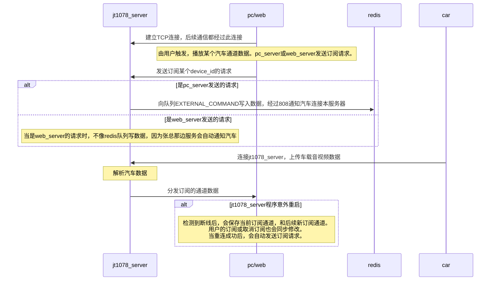

# multi_process_server
多进程服务器，包含多个进程，比如jt1078服务器、PC服务器，以及后续的SRS服务器

## 开发

### 目前第三方组件和端口使用情况

目前端口使用情况

| 服务          | 端口 | 说明                                            |
| ------------- | ---- | ----------------------------------------------- |
| jt1078_server | 9501 | 对外汽车连接                                    |
| jt1078_server | 9511 | 对内pc_server与web_server                       |
| redis         | 6379 | 看具体redis端口，目前jt1078_server会是会用redis |
| pc_server     | 9521 | 对外，Qt客户端连接，获取实时视频                |
| web_server    | 9531 | 对外，处理SRS回调。                             |

​	

### jt1078_server

`jt1078_server`与其他各个模块交互逻辑




### web_server

##### 提供的功能：

1. 提供音视频编解码功能，生成RTMP流，并推送到SRS
2. 提供Http服务器，支持SRS回调
3. 提供Http服务器，（与张总一起处理？，当浏览器播放某条视频时，向Http服务器发送消息，然后才播放。通过srs服务器，向jt1078服务器，订阅某个车辆数据。目前在SRS的on_play回调后，会自动发送订阅请求，不需要张总那边再向汽车发送请求了）
4. 提供发送订阅功能，连接jt1078_server，订阅或取消订阅数据

##### 测试接口

外界通知订阅通道

```bash
curl "http://127.0.0.1:9531/web_on_play" -X POST -d  "{\"device_id\":\"06495940943803\"}"
```

SRS回调接口-开始播放

```bash
curl "http://127.0.0.1:9531/api/v1/sessions" -X POST -d "{\"client_id\":\"dsfsdfsafd\",\"stream\":\"06495940943803\",\"action\":\"on_play\"}"
```

SRS回调接口-关闭窗口

```bash
curl "http://127.0.0.1:9531/api/v1/sessions" -X POST -d "{\"client_id\":\"dsfsdfsafd\",\"stream\":\"06495940943803\",\"action\":\"on_stop\"}"
```

SRS网页端播放连接

```bash
http://127.0.0.1:8080/live/06495940943803.flv
```


#### SRS相关

##### docker中srs的目录

```
/usr/local/srs
```

##### srs的http回调配置

回调配置项在http_hooks中。实时和历史需要各开一个。

```
vhost __defaultVhost__ {
    hls {
        enabled         on;
    }
    http_remux {
        enabled     on;
        mount       [vhost]/[app]/[stream].flv;
    }
    http_hooks {
    	enabled         on;
    	# 网页打开一个视频，会回调此接口
 		on_play			http://127.0.0.1:9992/api/v1/sessions;
        #关闭网页或者其他原因导致无法继续播放，会回调此接口
        on_stop			http://127.0.0.1:9992/api/v1/sessions;
    }
}

```

#### web_server与SRS的交互

通过在SRS的配置文件中配置`http_hooks`选项。

当回调`on_play`时，`web_server`向`jt1078_server`发送订阅请求。

当回调`on_stop`时，`web_server`向`jt1078_server`发送取消订阅请求。

`web_server`针对SRS的回调中不同的`client_id`有着统一处理，保证同一个通道，只会发送一次订阅/取消订阅请求，不会出现重复订阅/取消订阅的情况


#### 部署到线上服务器

##### 临时测试，替换实时服务器

1. 停止之前实时视频服务程序clang-1078，释放端口占用`9991(TCP)`和`9992(HTTP)`

2. 修改实时视频SRS的回调地址，之前是9992，修改为web_server的HTTP端口9531

3. 部署jt1078_server，修改jt1078.ini，对外端口使用之前实时服务器IP`9991`

4. 部署web_server，修改web.ini，连接9501端口，对外暴露9531端口，设置实时视频SRS端口1935

   

### 添加历史视频支持功能

说明：之前的旧逻辑是历史视频和实时视频服务器，使用的同一个程序，使用不同的配置文件，对外暴露不同的端口，连接不同的SRS实现的。

​		   这种做法，在后台只有1个程序时，可以处理。但是新版后台系统中，由于同时存在三个服务`jt1078_server`、`web_server`和`pc_server`。如果再使用拷贝一套的方法，部署到线上，操作和维护起来会比较麻烦。

​			所以就考虑，将历史视频处理逻辑也合并到程序中，使得一个程序即支持实时视频，也支持历史视频。这样后续维护起来也方便。

待处理问题：

1. jt1078_server额外添加端口，并区分的可能性
2. web_server应该如何区分实时视频和历史视频请求，并进行推送回调。
   1. 参考实时视频，维护一个历史视频表，历史视频相关的放到这个表中进行处理。
3. srs的改动
   1. 需要历史视频srs，

#### jt1078_server修改

1. 包头`ipc::packet_t`的`m_uPktType`添加类型标识，标识实时视频包，还是历史视频包。
2. 对外暴露一个端口，用来接收汽车历史数据。同时通过此端口的标识，自动添加历史视频标识。之前的实时端口自动标识实时视频
3. 再启动一个Jt1078Server类实例，用来处理历史视频数据，维护历史视频车辆的连接。
4. ForwardServer再添加一个订阅列表，表示历史视频订阅者列表。
5. 修改ForwardServer，在Publish时，添加历史或实时的区分。

#### web_server修改

1. 额外暴露一个端口，用来接收srs的历史视频回调。

#### pc_server修改

1. 暂时不需要修改，主要是jt1078_server和web_server修改。

#### qt_client修改


## 部署

### Docker部署

##### 创建docker容器


#### web_server

注意事项：

1. 对外暴露的端口号：9531


## 测试

##### 多个浏览器同时播放同一个车辆，相互之间关闭后，没有影响。

##### 多个PC客户端同时播放同一个车辆，随即关闭、全部关闭后，相互之间不影响。服务器正常发送退出请求。

##### 多浏览器+多客户端 同时播放同一个车辆，随即关闭，相互之间不影响。服务器正常发送订阅和取消订阅请求。

##### 多个浏览器+多个PC客户端，播放多量车，相互之间不影响。


## 其他

##### 网页端播放慢的原因分析

1、SRS会有数据缓存落地，来支持视频进度拖动。这就会导致天然的慢一些。（观察发现，web_server将数据推流过去之后，有个2~3秒左右延时）

2、web_server开始处理汽车jt1078数据时，需要SRS先通过on_play回调，web_server才会处理对应通道数据，推流到SRS，这里又会慢一些

​		（实际发现汽车连接到jt1078_server之后，srs的on_play回调还未过来，中间有个3~4秒延时。）

3、汽车连接到jt1078_server的延时（这个延时观察发现，除非是汽车设备问题，不会连接jt1078_server，否则大部分情况下，是on_play的回调更慢些，延时不在这里）

4、其他网络延时或者处理延时（延时很小，可以忽略）

**优化：**

1、 尝试使用其他SRS的回调，作为开启标识。

2、去除on_play回到再创建的标识。而是在接收到之后，就创建。

